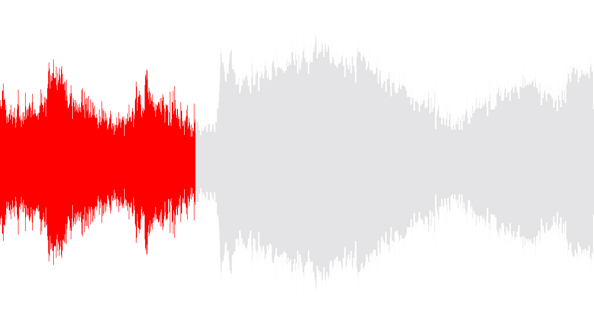
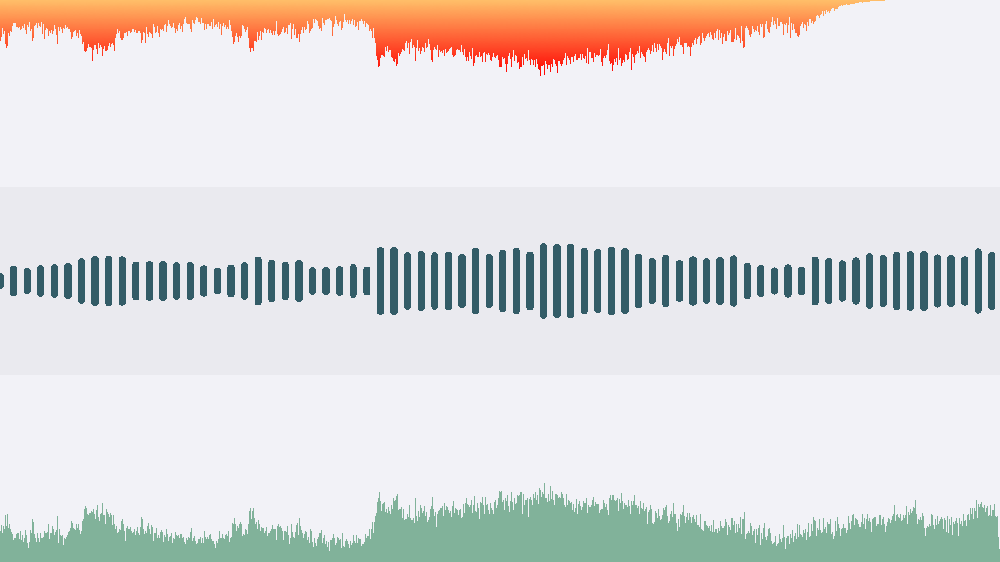

DSWaveformImage - iOS, macOS & visionOS realtime audio waveform rendering
===============
[](https://swift.org/package-manager)

DSWaveformImage offers a native interfaces for drawing the envelope waveform of audio data 
in **iOS**, **iPadOS**, **macOS**, **visionOS** or via Catalyst. To do so, you can use

* [`WaveformImageView`](Sources/DSWaveformImageViews/UIKit/WaveformImageView.swift) (UIKit) / [`WaveformView`](Sources/DSWaveformImageViews/SwiftUI/WaveformView.swift) (SwiftUI) to render a static waveform from an audio file or 
* [`WaveformLiveView`](Sources/DSWaveformImageViews/UIKit/WaveformLiveView.swift) (UIKit) / [`WaveformLiveCanvas`](Sources/DSWaveformImageViews/SwiftUI/WaveformLiveCanvas.swift) (SwiftUI) to realtime render a waveform of live audio data (e.g. from `AVAudioRecorder`)
* `WaveformImageDrawer` to generate a waveform `UIImage` from an audio file

Additionally, you can get a waveform's (normalized) `[Float]` samples directly as well by
creating an instance of `WaveformAnalyzer`.

Example UI (included in repository)
------------

For a practical real-world example usage of a SwiftUI live audio recording waveform rendering, see [RecordingIndicatorView](Example/DSWaveformImageExample-iOS/SwiftUIExample/SwiftUIExampleView.swift).


More related iOS Controls
------------

You may also find the following iOS controls written in Swift interesting:

* [SwiftColorWheel](https://github.com/dmrschmidt/SwiftColorWheel) - a delightful color picker
* [QRCode](https://github.com/dmrschmidt/QRCode) - a customizable QR code generator

If you really like this library (aka Sponsoring)
------------
I'm doing all this for fun and joy and because I strongly believe in the power of open source. On the off-chance though, that using my library has brought joy to you and you just feel like saying "thank you", I would smile like a 4-year old getting a huge ice cream cone, if you'd support my via one of the sponsoring buttons ☺️💕

If you're feeling in the mood of sending someone else a lovely gesture of appreciation, maybe check out my iOS app [💌 SoundCard](https://www.soundcard.io) to send them a real postcard with a personal audio message.

<a href="https://www.buymeacoffee.com/dmrschmidt" target="_blank"></a>

Installation
------------

* use SPM: add `https://github.com/dmrschmidt/DSWaveformImage` and set "Up to Next Major" with "14.0.0"

```swift
import DSWaveformImage // for core classes to generate `UIImage` / `NSImage` directly
import DSWaveformImageViews // if you want to use the native UIKit / SwiftUI views
```

Usage
-----

`DSWaveformImage` provides 3 kinds of tools to use
* native SwiftUI views - [SwiftUI example usage code](Example/DSWaveformImageExample-iOS/SwiftUIExample/SwiftUIExampleView.swift)
* native UIKit views - [UIKit example usage code](Example/DSWaveformImageExample-iOS/ViewController.swift)
* access to the raw renderes and processors

The core renderes and processors as well as SwiftUI views natively support iOS & macOS, using `UIImage` & `NSImage` respectively.

### SwiftUI

#### `WaveformView` - renders a one-off waveform from an audio file:

```swift
@State var audioURL = Bundle.main.url(forResource: "example_sound", withExtension: "m4a")!
WaveformView(audioURL: audioURL)
```

Default styling may be overridden if you have more complex requirements:

```swift
@State var audioURL = Bundle.main.url(forResource: "example_sound", withExtension: "m4a")!
WaveformView(audioURL: audioURL) { waveformShape in
    waveformShape
        .stroke(LinearGradient(colors: [.red, [.green, red, orange], startPoint: .zero, endPoint: .topTrailing), lineWidth: 3)
}
```

Similar to [AsyncImage](https://developer.apple.com/documentation/swiftui/asyncimage/init(url:scale:content:placeholder:)), a placeholder can be
set to show until the load and render operation completes successfully. Thanks to [@alfogrillo](https://github.com/alfogrillo)!

```swift
WaveformView(audioURL: audioURL) { waveformShape in
    waveformShape
        .stroke(LinearGradient(colors: [.red, [.green, red, orange], startPoint: .zero, endPoint: .topTrailing), lineWidth: 3)
} placeholder: {
    ProgressView()
}
```

#### `WaveformLiveCanvas` - renders a live waveform from `(0...1)` normalized samples:

```swift
@StateObject private var audioRecorder: AudioRecorder = AudioRecorder() // just an example
WaveformLiveCanvas(samples: audioRecorder.samples)
```

### UIKit

#### `WaveformImageView` - renders a one-off waveform from an audio file:

```swift
let audioURL = Bundle.main.url(forResource: "example_sound", withExtension: "m4a")!
waveformImageView = WaveformImageView(frame: CGRect(x: 0, y: 0, width: 500, height: 300)
waveformImageView.waveformAudioURL = audioURL
```

#### `WaveformLiveView` - renders a live waveform from `(0...1)` normalized samples:

Find a full example in the [sample project's RecordingViewController](Example/DSWaveformImageExample-iOS/RecordingViewController.swift).

```swift
let waveformView = WaveformLiveView()

// configure and start AVAudioRecorder
let recorder = AVAudioRecorder()
recorder.isMeteringEnabled = true // required to get current power levels

// after all the other recording (omitted for focus) setup, periodically (every 20ms or so):
recorder.updateMeters() // gets the current value
let currentAmplitude = 1 - pow(10, recorder.averagePower(forChannel: 0) / 20)
waveformView.add(sample: currentAmplitude)
```

### Raw API

#### Configuration

*Note:* Calculations are always performed and returned on a background thread, so make sure to return to the main thread before doing any UI work.

Check `Waveform.Configuration` in [WaveformImageTypes](./Sources/DSWaveformImage/WaveformImageTypes.swift) for various configuration options.

#### `WaveformImageDrawer` - creates a `UIImage` waveform from an audio file:

```swift
let waveformImageDrawer = WaveformImageDrawer()
let audioURL = Bundle.main.url(forResource: "example_sound", withExtension: "m4a")!
let image = try await waveformImageDrawer.waveformImage(
    fromAudioAt: audioURL,
    with: .init(size: topWaveformView.bounds.size, style: .filled(UIColor.black)),
    renderer: LinearWaveformRenderer()
)

// need to jump back to main queue
DispatchQueue.main.async {
    self.topWaveformView.image = image
}
```

#### `WaveformAnalyzer` - calculates an audio file's waveform sample:

```swift
let audioURL = Bundle.main.url(forResource: "example_sound", withExtension: "m4a")!
waveformAnalyzer = WaveformAnalyzer()
let samples = try await waveformAnalyzer.samples(fromAudioAt: audioURL, count: 200)
print("samples: \(samples)")
```

### Playback Progress Indication

If you're playing back audio files and would like to indicate the playback progress to your users, you can [find inspiration in the example app](https://github.com/dmrschmidt/DSWaveformImage/blob/main/Example/DSWaveformImageExample-iOS/ProgressViewController.swift). UIKit and [SwiftUI](https://github.com/dmrschmidt/DSWaveformImage/blob/main/Example/DSWaveformImageExample-iOS/SwiftUIExample/ProgressWaveformView.swift) examples are provided.

Both approaches will result in something like the image below. 

<div align="center">
  
</div>


There is currently no plan to integrate this as a 1st class citizen to the library itself, as every app will have different design requirements, and `WaveformImageDrawer` as well as `WaveformAnalyzer` are as simple to use as the views themselves as you can see in the examples.

### Loading remote audio files from URL

For one example way to display waveforms for audio files on remote URLs see https://github.com/dmrschmidt/DSWaveformImage/issues/22.

What it looks like
------------------

Waveforms can be rendered in 2 different ways and 5 different styles each.

By default [`LinearWaveformRenderer`](https://github.com/dmrschmidt/DSWaveformImage/blob/main/Sources/DSWaveformImage/Renderers/LinearWaveformRenderer.swift) is used, which draws a linear 2D amplitude envelope.

[`CircularWaveformRenderer`](https://github.com/dmrschmidt/DSWaveformImage/blob/main/Sources/DSWaveformImage/Renderers/CircularWaveformRenderer.swift) is available as an alternative, which can be passed in to the `WaveformView` or `WaveformLiveView` respectively. It draws a circular
2D amplitude envelope.

You can implement your own renderer by implementing [`WaveformRenderer`](https://github.com/dmrschmidt/DSWaveformImage/blob/main/Sources/DSWaveformImage/Renderers/WaveformRenderer.swift).
 
The following styles can be applied to either renderer:
 - **filled**: Use solid color for the waveform.
 - **outlined**: Draws the envelope as an outline with the provided thickness.
 - **gradient**: Use gradient based on color for the waveform.
 - **gradientOutlined**: Use gradient based on color for the waveform. Draws the envelope as an outline with the provided thickness.
 - **striped**: Use striped filling based on color for the waveform.

<div align="center">
  
</div>


### Live waveform rendering
https://user-images.githubusercontent.com/69365/127739821-061a4345-0adc-4cc1-bfd6-f7cfbe1268c9.mov


Migration
---------
### In 14.0.0
* Minimum iOS Deployment target is 15.0, macOS is 12.0 to remove internal usage of deprecated APIs
* `WaveformAnalyzer` and `WaveformImageDrawer` now return `Result<[Float] | DSImage, Error>` when used with completionHandler for better error handling
* `WaveformAnalyzer` is now stateless and requires the URL in `.samples(fromAudioAt:count:qos:)` instead of its constructor
* SwiftUI's `WaveformView` has a new constructor that provides optional access to the underlying `WaveformShape`, which is now used for rendering, see [#78](https://github.com/dmrschmidt/DSWaveformImage/issues/78)

### In 13.0.0
* Any mentions of `dampening` & similar were corrected to `damping` etc in [11460b8b](https://github.com/dmrschmidt/DSWaveformImage/commit/11460b8b8203f163868ba774d1533116d2fe68a1). Most notably in `Waveform.Configuration`. See [#64](https://github.com/dmrschmidt/DSWaveformImage/issues/64). 
* styles `.outlined` & `.gradientOutlined` were added to `Waveform.Style`, see https://github.com/dmrschmidt/DSWaveformImage#what-it-looks-like
* `Waveform.Position` was removed. If you were using it to place the view somewhere, move this responsibility up to its parent for positioning, like with any other view as well.

### In 12.0.0
* The rendering pipeline was split out from the analysis. You can now create your own renderes by subclassing [`WaveformRenderer`](https://github.com/dmrschmidt/DSWaveformImage/blob/main/Sources/DSWaveformImage/Renderers/WaveformRenderer.swift).
* A new [`CircularWaveformRenderer`](https://github.com/dmrschmidt/DSWaveformImage/blob/main/Sources/DSWaveformImage/Renderers/CircularWaveformRenderer.swift) has been added.
* `position` was removed from `Waveform.Configuration`, see [0447737](https://github.com/dmrschmidt/DSWaveformImage/commit/044773782092becec0424527f6feef061988db7a).
* new `Waveform.Style` option have been added and need to be accounted for in `switch` statements etc.

### In 11.0.0 
the library was split into two: `DSWaveformImage` and `DSWaveformImageViews`. If you've used any of the native views bevore, just add the additional `import DSWaveformImageViews`.
The SwiftUI views have changed from taking a Binding to the respective plain values instead.

### In 9.0.0 
a few public API's have been slightly changed to be more concise. All types have also been grouped under the `Waveform` enum-namespace. Meaning `WaveformConfiguration` for instance has become `Waveform.Configuration` and so on.

### In 7.0.0 
colors have moved into associated values on the respective `style` enum.

`Waveform` and the `UIImage` category have been removed in 6.0.0 to simplify the API.
See `Usage` for current usage.

## See it live in action

[SoundCard - postcards with sound](https://www.soundcard.io) lets you send real, physical postcards with audio messages. Right from your iOS device.

DSWaveformImage is used to draw the waveforms of the audio messages that get printed on the postcards sent by [SoundCard - postcards with audio](https://www.soundcard.io).

&nbsp;

<div align="center">
    <a href="http://bit.ly/soundcardio">
        
        
Download SoundCard on the App Store.
    </a>
</div>

&nbsp;

<a href="http://bit.ly/soundcardio">

</a>
